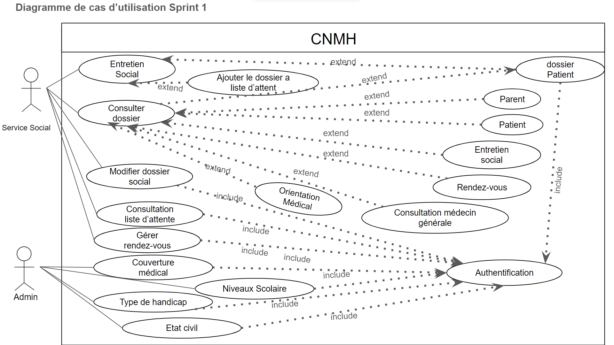

# Scénario Gestion Les Rendez-vous

## Travail à faire

Tester le sénario Gérer les rendez-vous

## Critères de validation
- Scénarios
  - Structure de la documentation de cas d'utilisation
  - Rédaction de scénarios en UML (diagramme de séquence)
  - Validation des scénarios dans l'application
- UI: Interfaces
  - Chart graphique (maquettage de prototype)
  - Langue

## Entrée

- Diagramme de cas d'utilisation - sprint1
  

- Application CNMH

## Livrable
[Scénario gestion de rendez-vous ](https://docs.google.com/presentation/d/1d9Bl9QKTl4_vsFA0oWER7LfaX9nveLHx/edit?usp=sharing&ouid=104079302148884844878&rtpof=true&sd=true)
